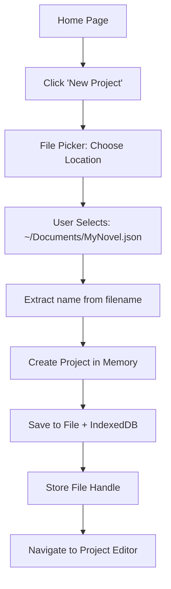
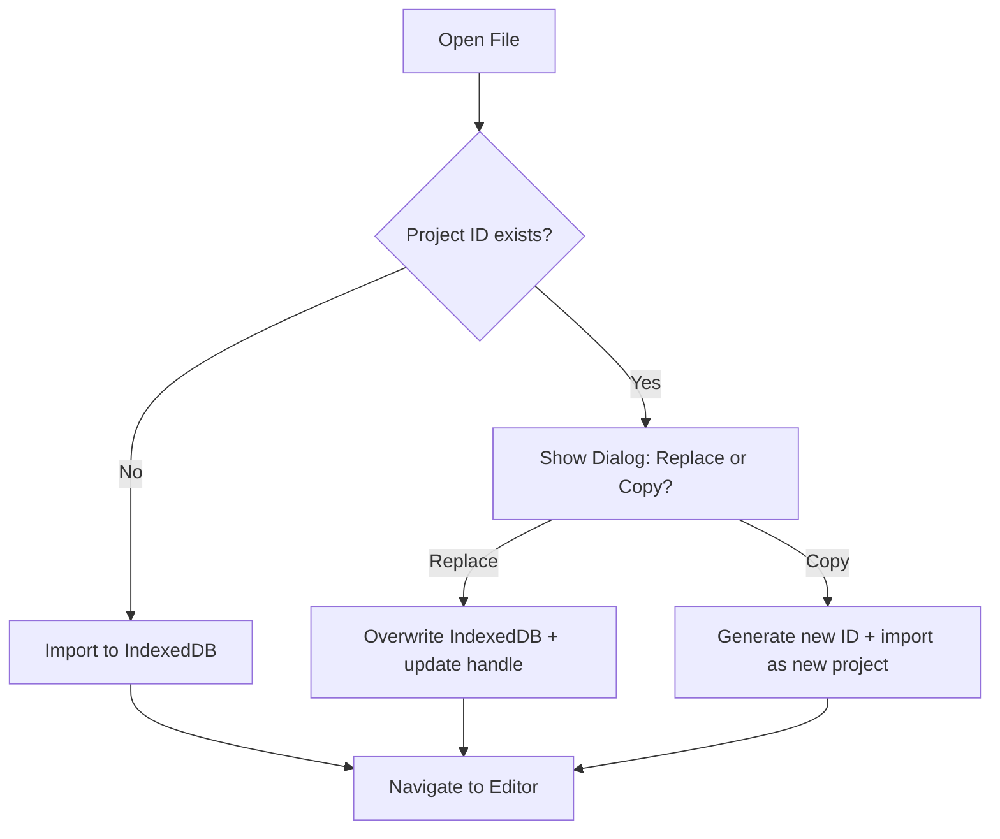
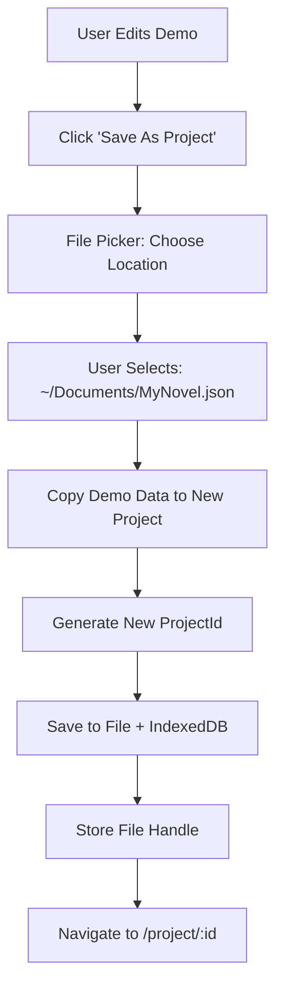

# ADR 007: File Storage Architecture

## Status

Accepted

## Context

The narrative development tool currently uses IndexedDB for storage with demo data as the only content source. Users need the ability to create named projects that persist to the filesystem with automatic syncing, similar to VS Code or other desktop applications.

### Requirements

1. **Persistent Named Projects**: Users can create multiple projects with custom names
2. **Auto-save to Filesystem**: Changes automatically write back to the user's chosen file location
3. **Seamless UX**: File location chosen once on project creation, then auto-syncs transparently
4. **Development Support**: Must work on localhost for development
5. **Chrome-only Initially**: Target Chrome/Edge browsers with native File System Access API
6. **Existing Architecture**: Build on existing [`IndexedDBProvider`](../../../src/utils/storage/IndexedDBProvider.ts) and [`ProjectStorage`](../../../src/features/writing-project/storage/ProjectStorage.ts)

### Technical Constraints

- File System Access API requires HTTPS in production (localhost exempted)
- File System Access API support: Chrome/Edge (native support)
- File handle persistence: File System Access API handles can be stored in IndexedDB
- Must maintain "seamless UX" principle from constraints
- Must follow feature isolation pattern (ADR-001)

## Decision

### 1. Storage Architecture: Dual Source of Truth with Auto-sync

**Decision**: IndexedDB and filesystem are synchronized automatically. User chooses file location once, then all edits auto-save to both storage layers.

**Storage Layers**:

```
┌─────────────────────────────────┐
│   In-Memory Project State       │  ← User Editing
│   (Vue Reactive Refs)           │
└────────────────┬────────────────┘
                 │
                 │ Debounced (2s)
                 │
┌────────────────▼────────────────┐
│   Dual Auto-save                │
│   ├─▶ IndexedDB (fast cache)   │
│   └─▶ Filesystem (persistent)  │
└─────────────────────────────────┘

Storage Details:
┌─────────────────────────────────┐
│   IndexedDB                     │
│   - Project data (JSON)         │
│   - File handle reference       │
│   - Metadata (name, modified)   │
└─────────────────────────────────┘

┌─────────────────────────────────┐
│   Filesystem (.json)            │
│   - User-chosen location        │
│   - Always in sync              │
│   - Git/backup-friendly         │
└─────────────────────────────────┘
```

**Sync Strategy**:

- **New Project**: User prompted to choose save location immediately (like "Save As")
- **File Handle Stored**: File System Access API handle persisted in IndexedDB
- **Auto-save**: Every edit triggers debounced (2s) save to BOTH IndexedDB and filesystem
- **Permission Handling**: If filesystem write fails (permissions lost), re-prompt user
- **Open Existing**: User picks file → handle stored → future edits auto-sync

**Rationale**:

- **Desktop App UX**: Matches VS Code, Figma, etc. - pick location once, auto-saves forever
- **No "Export" Confusion**: File is always up-to-date, no manual export step
- **Backup-Friendly**: Standard backup tools (Time Machine, etc.) catch all changes
- **Clear Mental Model**: "This is my file" vs "I need to remember to export"

**Trade-offs**:

- ✅ Seamless auto-save experience
- ✅ Files always in sync with editing state
- ✅ External tools work (git, backup, version control)
- ✅ No user confusion about export
- ❌ File picker on every new project (acceptable one-time cost)
- ❌ Must handle permission loss scenarios
- ❌ Chrome-only initially (acceptable trade-off)

### 2. Library Selection: Native File System Access API

**Decision**: Use native File System Access API directly (no external library).

**Rationale**:

- **Chrome-only Target**: No need for cross-browser fallbacks
- **Zero Bundle Size**: Native browser API
- **Full Feature Access**: Direct access to file handles, permissions API
- **Future-proof**: Standard browser API, long-term support

**Key API Features Used**:

1. **`window.showSaveFilePicker()`**: Choose location for new project
2. **`window.showOpenFilePicker()`**: Open existing project file
3. **`FileSystemFileHandle`**: Reference to file for reading/writing
4. **IndexedDB Handle Storage**: Persist file handle via serialization
5. **`createWritable()`**: Atomic file writes (safe, no corruption)

**Permission Model**:

```typescript
// Store file handle in IndexedDB
const handle: FileSystemFileHandle = await window.showSaveFilePicker({
  suggestedName: 'Untitled Project.json',
  types: [
    {
      description: 'Project Files',
      accept: { 'application/json': ['.json'] },
    },
  ],
})
await projectStorage.saveFileHandle(projectId, handle)

// Later, check permissions before each write
const permission = await handle.queryPermission({ mode: 'readwrite' })
if (permission !== 'granted') {
  const newPermission = await handle.requestPermission({ mode: 'readwrite' })
  if (newPermission !== 'granted') {
    throw new Error('File permission denied')
  }
}

// Write to file (atomic operation)
const writable = await handle.createWritable()
await writable.write(JSON.stringify(projectData, null, 2))
await writable.close()
```

**File Handle Serialization**:

```typescript
// File System Access API handles are serializable in IndexedDB
// Store alongside project metadata
interface ProjectMetadata {
  projectId: string
  name: string
  filePath: string // Display only: "~/Documents/MyNovel.json"
  fileHandle: FileSystemFileHandle // Actual handle
  templateId: string
  templateVersion: number
  createdAt: string
  lastModified: string
}
```

### 3. Project Creation & Management Flow

**Decision**: File-first project management system

#### 3.1 Project Creation Flow



**Steps**:

1. User clicks "New Project" on home page
2. Native file picker opens: "Save new project as..."
   - Suggested filename: "Untitled Project.json"
   - Default directory: User's last-used location or Documents
   - File filter: `.json` only
3. User chooses location and filename
4. Extract project name from filename (strip `.json` extension)
5. Create project in-memory with [`createNewProject(name)`](../../../src/features/writing-project/domain/projectFactory.ts)
6. Write initial project data to filesystem
7. Save project data AND file handle to IndexedDB
8. Navigate to project editor (`/project/:projectId`)

**Why File Picker First?**

- Establishes save location immediately (no "untitled" projects in browser-only storage)
- User knows where their file lives from the start
- Matches native app behavior (File → New in most apps prompts for location)
- Enables immediate auto-save without later prompting
- No confusion about where data is stored

#### 3.2 Project List (Home Page)

**Data Source**: IndexedDB via [`ProjectStorage`](../../../src/features/writing-project/storage/ProjectStorage.ts)

**Display**:

- Grid of project cards (similar to existing demo/new project cards)
- "New Project" button (opens file picker)
- "Open File" button (opens existing project from filesystem)
- Each project card shows:
  - Project name (derived from filename or editable)
  - File path (abbreviated: `~/Documents/MyNovel.json`)
  - Last modified date/time
  - Template type badge (e.g., "Snowflake v1")

**Actions on Project Cards**:

- **Open**: Navigate to project editor
- **Delete**: Remove from IndexedDB (file remains on filesystem - user choice)
- **Reveal in Finder**: Open filesystem location (future enhancement)

**New ProjectStorage Methods**:

```typescript
// List all projects with metadata
async listAll(): Promise<ProjectMetadata[]>

// Save file handle for auto-sync
async saveFileHandle(projectId: string, handle: FileSystemFileHandle): Promise<void>

// Retrieve file handle for auto-save
async getFileHandle(projectId: string): Promise<FileSystemFileHandle | null>

// Save to both IndexedDB and filesystem
async saveWithSync(data: ProjectData): Promise<void>

// Delete from IndexedDB only
async delete(projectId: string): Promise<void>
```

#### 3.3 Auto-save Implementation

**Trigger**: Watch project state in [`useProjectData()`](../../../src/features/writing-project/domain/useProjectData.ts)

**Flow**:

```typescript
// In useProjectData composable
watch(
  projectState,
  async (newProject) => {
    // Debounced save (2 seconds)
    await debouncedSave()
  },
  { deep: true }
)

async function debouncedSave() {
  try {
    // 1. Save to IndexedDB (fast, local)
    await projectStorage.save(projectState.value)

    // 2. Get file handle
    const handle = await projectStorage.getFileHandle(projectState.value.projectId)
    if (!handle) return // No file handle (demo mode?)

    // 3. Check/request permissions
    const permission = await handle.queryPermission({ mode: 'readwrite' })
    if (permission !== 'granted') {
      await handle.requestPermission({ mode: 'readwrite' })
    }

    // 4. Write to filesystem
    const writable = await handle.createWritable()
    await writable.write(JSON.stringify(projectState.value, null, 2))
    await writable.close()

    // 5. Update last modified timestamp
    projectState.value.lastModified = new Date().toISOString()
  } catch (error) {
    console.error('Auto-save failed:', error)
    // Show non-blocking error toast: "Failed to save to file"
    // Offer "Save As" to choose new location
  }
}
```

**Error Handling**:

- **Permission Denied**: Show error toast, offer "Save As" to new location
- **File Moved/Deleted**: Detect write failure, prompt to choose new location
- **Disk Full**: Show error, suggest freeing space or choosing new location
- **IndexedDB Fails**: Critical error, show modal warning

#### 3.4 Open Existing Project

**Flow**:

1. User clicks "Open File" on home page
2. Native file picker opens (filter: `.json` files)
3. User selects a project file
4. Read file contents, parse JSON
5. Validate schema with [`migrateProjectData()`](../../../src/features/writing-project/storage/migrations.ts)
6. Check if project already exists in IndexedDB (by `projectId`)
   - If exists: Offer "Replace" or "Open as Copy"
   - If new: Import directly
7. Save project data AND file handle to IndexedDB
8. Navigate to project editor

**Duplicate Handling**:



### 4. File Handle Persistence & Security

**Decision**: Store file handles in IndexedDB with permission re-validation on each session.

**Handle Storage**:

- File System Access API handles are directly serializable in IndexedDB
- Browser manages handle persistence and sandboxing
- Handles are origin-bound (cannot be accessed from different domains)

**Permission Lifecycle**:

1. **First Save**: User grants permission via file picker (implicit grant)
2. **Subsequent Saves**: Use stored handle, check `queryPermission()` first
3. **Permission Lost**: If denied, call `requestPermission()` (shows browser prompt)
4. **User Denies**: Show error, offer "Save As" to new location
5. **Session Restart**: Permissions may be revoked, always validate before write

**Security Considerations**:

- **Origin-bound**: Handles only work on same origin (https://example.com)
- **User Gesture Required**: Initial file picker requires user interaction
- **Transparent Prompts**: Permission re-requests show browser-native UI
- **No Path Access**: Can't enumerate directories or access sibling files
- **Safe Writes**: `createWritable()` uses atomic writes (temp file → rename)

### 5. Demo Data Strategy

**Decision**: Keep demo as read-only preview; add "Save As Project" conversion option.

#### 5.1 Demo Behavior

- **Route**: `/demo` (existing)
- **Data**: Static [`demo/project-data.ts`](../../../src/features/demo/project-data.ts)
- **Storage**: None (fully in-memory)
- **Editing**: Enabled (changes lost on refresh)
- **Purpose**: Zero-friction exploration of the tool

#### 5.2 "Save As Project" Flow



**Implementation**:

- Button in demo page header: "Save As Project"
- Opens file picker immediately (no name dialog needed)
- Copy demo data → new `ProjectData` with new UUID
- Save to chosen file location
- Store file handle in IndexedDB
- Redirect to persistent project editor

#### 5.3 Demo Link on Home Page

- Keep existing "Try Demo" card
- Demo remains fastest path to explore the tool
- No file picker, no storage, no friction

**Rationale**:

- **Zero-Friction Demo**: New users can explore without any setup
- **Easy Conversion**: Natural upgrade path from demo to real project
- **Marketing Value**: Demo is shareable, embeddable, ideal for onboarding
- **Clear Distinction**: "Try it" (demo) vs "Use it" (project with file)

### 6. PWA Implementation Timeline

**Decision**: PWA is out of scope for this feature; implement in separate phase.

**Reasoning**:

1. **Feature Complexity**: File persistence is already complex; PWA adds service workers, caching, offline UI
2. **Independent Value**: File persistence provides full value without PWA
3. **Non-Breaking Addition**: PWA can be added later without changing file storage
4. **Testing Complexity**: PWA requires additional E2E testing for offline scenarios

**Future PWA Scope** (separate feature):

- Service worker for offline editing (with IndexedDB cache)
- Install prompt for desktop/mobile
- App manifest with icons and theme
- Background sync (optional, file sync continues to work)

**Recommendation**: Ship file persistence first, validate with users, add PWA if needed.

### 7. Development & Testing Support

#### 7.1 Localhost Development

**File System Access API Behavior**:

- ✅ Works on `http://localhost:*` (HTTPS not required)
- ✅ Works on `http://127.0.0.1:*`
- ❌ Blocked on `http://192.168.*` (use localhost instead)

**Project Configuration**:

- Vite dev server: `http://localhost:5173` (already configured)
- No special configuration needed

#### 7.2 Testing Strategy

**Unit Tests** (Vitest):

- Mock `window.showSaveFilePicker()` / `showOpenFilePicker()`
- Mock `FileSystemFileHandle` with in-memory implementation
- Test `ProjectStorage` new methods (`saveWithSync()`, `getFileHandle()`)
- Test error handling (permission denied, file deleted, etc.)

**Integration Tests** (Vitest Browser Mode):

- Full flow: Create → Edit → Auto-save → Reload → Open
- Mock file system API with test fixtures
- Verify IndexedDB state matches filesystem writes

**E2E Tests** (Playwright):

- Smoke test: Create project → see in list → open → edit
- Use Playwright's file chooser API for automation
- Verify file exists on filesystem (temp test directory)
- Open existing file → verify loads correctly

**Manual Testing**:

- Test on Chrome (primary target)
- Test permission loss/recovery scenarios
- Test filesystem errors (move file while open, delete file, etc.)
- Test rapid edits (debounce behavior)

#### 7.3 Production Deployment

**Requirements**:

- ✅ HTTPS required for File System Access API in production
- ✅ Chrome/Edge browser required (show error message on other browsers)

**Deployment Checklist**:

- [ ] Deploy to HTTPS origin (Vercel, Netlify, Cloudflare Pages)
- [ ] Add browser detection with helpful error for Firefox/Safari
- [ ] Test file handle persistence across sessions
- [ ] Test permission re-validation on page reload

## Consequences

### Positive

1. **Seamless UX**: Files auto-save like VS Code, no export step
2. **Clear File Location**: User knows exactly where their project file lives
3. **Git-Friendly**: Files are plain JSON in user-chosen location
4. **Backup-Compatible**: Standard backup tools work automatically
5. **Zero Bundle Size**: Native API, no external dependencies
6. **Reliable Auto-save**: Debounced writes prevent data loss
7. **Desktop App Feel**: Professional tool behavior
8. **Development-Friendly**: Works seamlessly on localhost
9. **Atomic Writes**: `createWritable()` prevents file corruption

### Negative

1. **Chrome-only Initially**: No Firefox/Safari support (acceptable for v1)
2. **File Picker on Creation**: Required interaction before editing (minor friction)
3. **Permission Management**: Must handle revoked/expired permissions gracefully
4. **Dual-storage Complexity**: Must keep IndexedDB and filesystem in sync
5. **File Format Lock-in**: JSON format must remain stable (need migrations)

### Neutral

1. **PWA Deferred**: Offline support and install prompts are future enhancements
2. **Demo Remains Separate**: Demo is not automatically converted to project
3. **File Picker UX**: Native file pickers vary by OS (can't customize appearance)

### Migration & Compatibility

**Existing Users** (if any):

- Current demo-only users: No migration needed (demo continues to work)
- Future migration: If we ever stored projects in IndexedDB without file handles, prompt to "Save to File"

**Browser Support**:

- Chrome/Edge: Full support ✅
- Firefox: Not supported, show error message with explanation
- Safari: Not supported, show error message with explanation
- Mobile: File System Access API limited, consider falling back to IndexedDB-only mode

## Implementation Phases

See companion feature plan: [`../../planning/archive/file-storage-implementation.md`](../../planning/active/file-storage-implementation.md)

## Open Questions

1. **File Extension**: Use `.json` or create custom extension like `.novel` or `.snowflake`?
   - **Decision**: Use `.json` for v1 (readable, git-friendly, debuggable)
   - Future: Support custom extension with JSON inside

2. **File Format Version**: How to handle breaking changes?
   - **Decision**: Add `fileFormatVersion: 1` field to ProjectData
   - Use existing `migrateProjectData()` function for upgrades

3. **Browser Detection**: Show error or graceful degradation on non-Chrome browsers?
   - **Decision**: Show friendly error with "Chrome required" message for v1
   - Future: Add IndexedDB-only fallback mode

4. **Project Deletion**: Delete file from filesystem or just remove from IndexedDB?
   - **Decision**: Only remove from IndexedDB, preserve file (safer)
   - User can manually delete file if desired

5. **Auto-save Indicator**: Show "Saving..." or "Saved" status?
   - **Decision**: Show subtle indicator (dot → checkmark) but don't be distracting
   - Follow VS Code pattern

## References

- [File System Access API (MDN)](https://developer.mozilla.org/en-US/docs/Web/API/File_System_Access_API)
- [File System Access API (web.dev)](https://web.dev/file-system-access/)
- [ADR-001: Feature Isolation](adr-001-feature-isolation.md)
- [ADR-004: Process Template Pattern](adr-004-process-template.md)
- [Existing IndexedDBProvider](../../../src/utils/storage/IndexedDBProvider.ts)
- [Existing ProjectStorage](../../../src/features/writing-project/storage/ProjectStorage.ts)
- [`workflow-general` Skill](../../../.roo/skills/workflow-general/SKILL.md)
