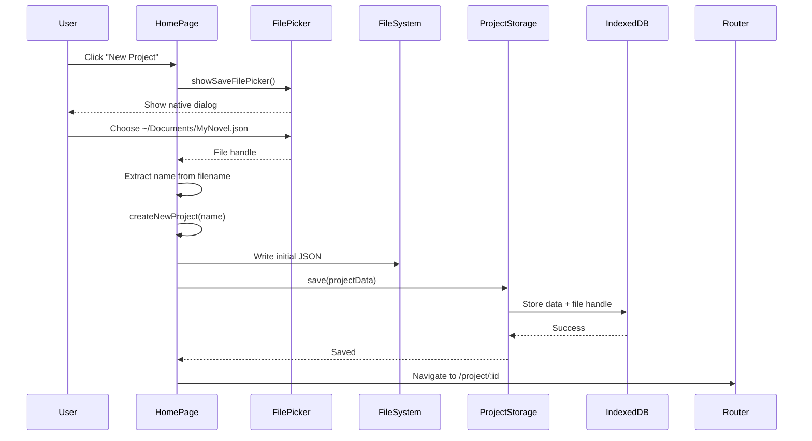
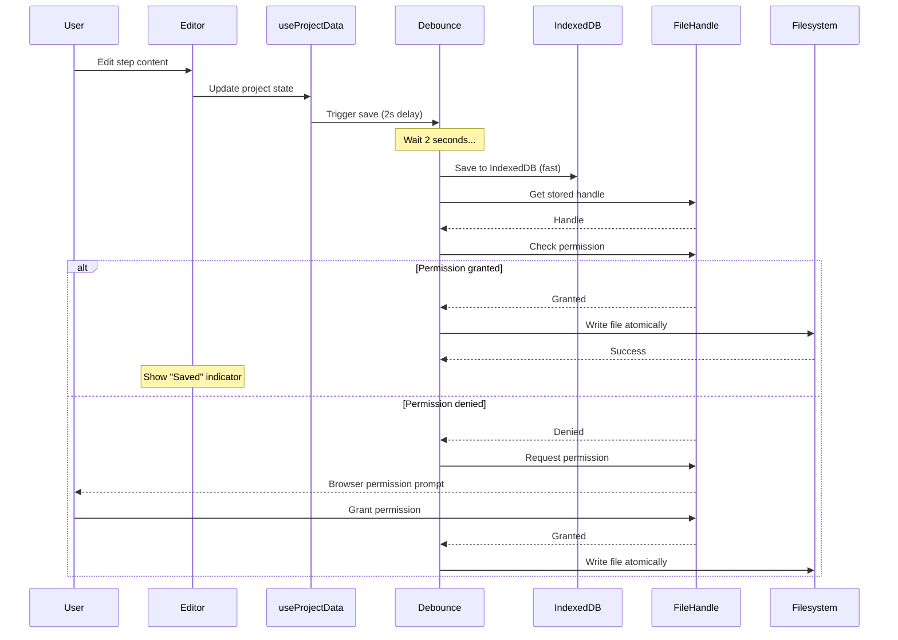
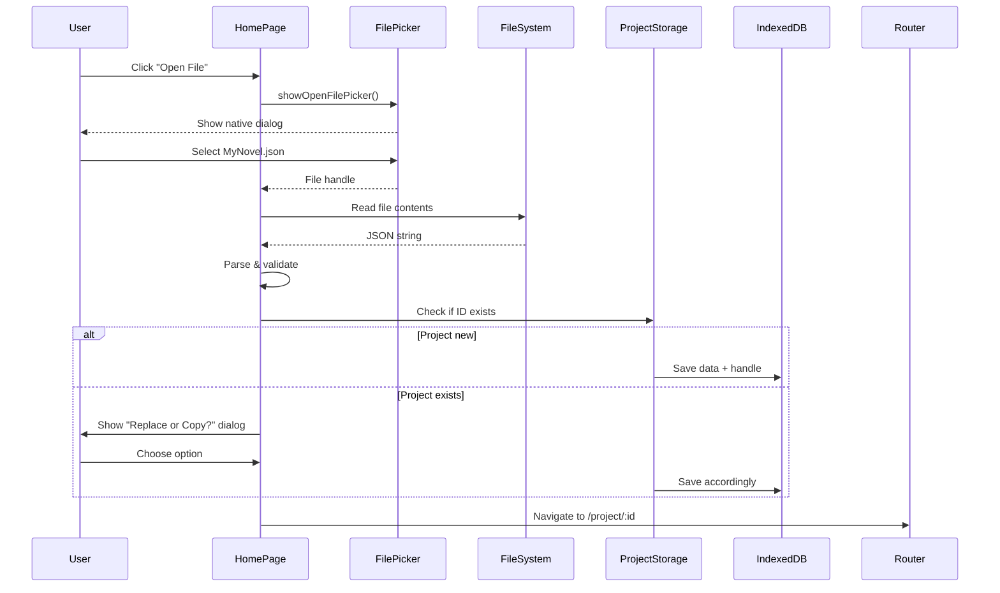

# Feature Plan: File Storage & Project Management

## Overview

Implement file storage capabilities where users create named projects that auto-sync to both IndexedDB and filesystem. Projects are tied to a user-chosen file location from creation, providing a seamless desktop-app experience similar to VS Code.

## Goals

- [x] Design storage architecture (dual source of truth with auto-sync)
- [ ] Implement file handle persistence in IndexedDB
- [ ] Add project creation with file picker
- [ ] Build home page project list UI
- [ ] Implement auto-save to filesystem on every edit
- [ ] Implement open existing file functionality
- [ ] Add "Save Demo As Project" conversion
- [ ] Migrate routes to file-based projects
- [ ] Add auto-save with debouncing (2s)
- [ ] Implement permission recovery handling
- [ ] Add save status indicator

## Out of Scope

- **PWA Features**: Service worker, offline support, install prompts (separate feature)
- **Cross-browser Support**: Firefox/Safari compatibility (Chrome/Edge only for v1)
- **Cloud Sync**: Multi-device synchronization via cloud storage
- **Real-time Collaboration**: Multiple users editing same project
- **Version History**: Tracking changes over time (users can use git on exported files)
- **Project Templates**: Pre-built starter projects (separate feature)
- **File Watchers**: Detecting external file changes (future enhancement)

## High Level Architecture, Data Flow

### ADR Alignment

- **ADR-001 (Feature Isolation)**: File storage lives in [`src/features/writing-project/storage/`](../../../src/features/writing-project/storage/)
- **ADR-004 (Process Template)**: Project files include `templateId` to support multiple methodologies
- **ADR-007 (File Storage)**: Dual source of truth with auto-sync to filesystem

### State Management

```
┌─────────────────────────────────────────────────────────┐
│  Home Page (HomePage.vue)                               │
│  ┌───────────────────────────────────────────────────┐  │
│  │  useProjectList                                   │  │
│  │  - loadProjects()                                 │  │
│  │  - createNewProject() → file picker              │  │
│  │  - openExistingFile() → file picker              │  │
│  │  - deleteProject(id)                              │  │
│  └───────────────────────┬───────────────────────────┘  │
└────────────────────────────┼────────────────────────────┘
                             │
                             ▼
        ┌────────────────────────────────────┐
        │  ProjectStorage (Enhanced)         │
        │  - listAll()                       │
        │  - save(project)                   │
        │  - saveWithSync(project)           │
        │  - loadById(id)                    │
        │  - delete(id)                      │
        │  - saveFileHandle(id, handle)      │
        │  - getFileHandle(id)               │
        └────────────────┬───────────────────┘
                         │
        ┌────────────────┼────────────────────┐
        │                ▼                    │
        │  ┌────────────────────────────┐    │
        │  │  IndexedDBProvider         │    │
        │  │  - Project data            │    │
        │  │  - File handles            │    │
        │  │  - Metadata                │    │
        │  └────────────────────────────┘    │
        │                                     │
        │                ▼                    │
        │  ┌────────────────────────────┐    │
        │  │  File System Access API    │    │
        │  │  - Read/write files        │    │
        │  │  - Handle persistence      │    │
        │  │  - Permission management   │    │
        │  └────────────────────────────┘    │
        └─────────────────────────────────────┘

┌─────────────────────────────────────────────────────────┐
│  Project Editor (WritingProjectPage.vue)                │
│  ┌───────────────────────────────────────────────────┐  │
│  │  useProjectData (Enhanced)                        │  │
│  │  - Auto-save to IndexedDB + Filesystem (2s)       │  │
│  │  - Handle permission recovery                     │  │
│  │  - Update lastModified timestamp                  │  │
│  │  - Show save status indicator                     │  │
│  └───────────────────────┬───────────────────────────┘  │
└────────────────────────────┼────────────────────────────┘
                             │
                             ▼
        ┌────────────────────────────────────┐
        │  FileSystemService (New)           │
        │  - writeToFile(handle, data)       │
        │  - readFromFile(handle)            │
        │  - checkPermission(handle)         │
        │  - requestPermission(handle)       │
        │  Native File System Access API     │
        └────────────────────────────────────┘
```

### Data Flow: Project Creation (File-First)



### Data Flow: Auto-save During Editing



### Data Flow: Open Existing File



## User Stories

### Value Statement

As a writer, I want my projects to auto-save to files on my computer so that I can use familiar tools like Finder, Backups, and Git without worrying about exporting manually.

### Story 1: Create New Project with File Location

**Acceptance Criteria**:

- Given I am on the home page
- When I click "New Project"
- Then a native file picker opens with suggested name "Untitled Project.json"
- When I choose location ~/Documents/MyNovel.json
- Then a new project is created with name "MyNovel"
- And the project is saved to ~/Documents/MyNovel.json
- And I am navigated to the project editor
- And the file path shows in the editor header

**Technical Notes**:

- Use `window.showSaveFilePicker()` with JSON file type filter
- Extract name from filename (strip `.json`)
- Use existing [`createNewProject()`](../../../src/features/writing-project/domain/projectFactory.ts)
- Store file handle in IndexedDB alongside project data
- Route: `/project/:projectId`

**Data Contract**:

```typescript
interface ProjectMetadata {
  projectId: string
  name: string
  filePath: string // Display: "~/Documents/MyNovel.json"
  fileHandle: FileSystemFileHandle // For auto-save
  templateId: string
  templateVersion: number
  createdAt: string
  lastModified: string
}
```

### Story 2: Auto-save to Filesystem on Every Edit

**Acceptance Criteria**:

- Given I am editing a project
- When I make a change to step content
- Then the change is saved to IndexedDB immediately
- And the change is saved to the filesystem after 2 seconds (debounced)
- And I see a save status indicator (dot → checkmark)
- When I make another change within 2 seconds
- Then the timer resets (debouncing)
- And both saves eventually complete

**Technical Notes**:

- Enhance [`useProjectData()`](../../../src/features/writing-project/domain/useProjectData.ts)
- Use existing [`useDebouncedEmit()`](../../../src/utils/useDebouncedEmit.ts) or VueUse `watchDebounced`
- Watch project state, trigger dual save on change
- Update `lastModified` timestamp on each save
- Handle save errors gracefully (log, show toast, offer "Save As")

**Error Scenarios**:

- **Permission Lost**: Request permission again, show prompt
- **File Deleted**: Show error, offer "Save As" to new location
- **Disk Full**: Show error toast, suggest freeing space
- **IndexedDB Fails**: Critical error, show modal warning

### Story 3: List All Projects on Home Page

**Acceptance Criteria**:

- Given I have created 3 projects
- When I visit the home page
- Then I see all 3 projects listed as cards
- And each card shows:
  - Project name
  - File path (abbreviated)
  - Last modified date
  - Template type badge
- And each card has an "Open" button
- And projects are sorted by last modified (most recent first)

**Technical Notes**:

- New [`ProjectStorage.listAll()`](../../../src/features/writing-project/storage/ProjectStorage.ts) method
- IndexedDB query to get all keys with `PROJECT_PREFIX`
- Display as grid of cards (similar to existing demo card)
- Use VueUse `useTimeAgo` for relative dates

### Story 4: Open Existing File from Filesystem

**Acceptance Criteria**:

- Given I am on the home page
- When I click "Open File"
- Then a native file picker opens (filter: `.json`)
- When I select a valid project JSON file
- Then the file content is read and validated
- And if the project is new, it's imported to IndexedDB
- And if the project exists, I see a dialog: "Replace or Open as Copy?"
- When I choose "Replace"
- Then the IndexedDB project is updated with file contents
- And future edits sync to that file
- When I navigate to the project editor
- Then I see all the project content loaded

**Technical Notes**:

- Use `window.showOpenFilePicker()` with JSON file type filter
- Read file via `handle.getFile()` then `file.text()`
- Validate schema with [`migrateProjectData()`](../../../src/features/writing-project/storage/migrations.ts)
- Handle duplicate `projectId`: show modal with options
- Store file handle for future auto-save

### Story 5: Delete Project from List

**Acceptance Criteria**:

- Given I am on the home page viewing my project list
- When I click a "Delete" button on a project card
- Then a confirmation dialog appears: "Remove MyNovel from list? (File will remain on disk)"
- When I confirm deletion
- Then the project is removed from IndexedDB
- And the project card disappears from the list
- And the file remains on disk (not deleted)
- When I click "Open File" and select that file again
- Then I can re-import the project

**Technical Notes**:

- New [`ProjectStorage.delete()`](../../../src/features/writing-project/storage/ProjectStorage.ts) method
- Only removes from IndexedDB, does not delete filesystem file (safer)
- Confirmation modal with clear messaging
- Update project list UI after deletion

### Story 6: Save Demo As Project

**Acceptance Criteria**:

- Given I am viewing the demo project
- When I make edits to the demo content
- And I click "Save As Project" in the toolbar
- Then a native file picker opens
- When I choose location ~/Documents/MyFirstNovel.json
- Then the demo content is copied to a new project
- And the new project is saved to the chosen file
- And the file handle is stored in IndexedDB
- And I am redirected to `/project/:projectId`
- And future edits auto-sync to ~/Documents/MyFirstNovel.json

**Technical Notes**:

- Add "Save As Project" button to [`DemoPage.vue`](../../../src/features/demo/DemoPage.vue) header
- Open file picker immediately (no name dialog needed)
- Copy demo data → new `ProjectData` with new UUID
- Extract name from chosen filename
- Save to file and IndexedDB
- Store file handle
- Navigate to project editor

### Story 7: Handle Permission Loss Gracefully

**Acceptance Criteria**:

- Given I am editing a project
- When the browser revokes filesystem permissions (session expired)
- And I make an edit
- Then auto-save to IndexedDB succeeds
- And auto-save to filesystem fails
- And I see a toast: "Permission required to save file"
- When I click "Grant Permission"
- Then a browser permission prompt appears
- When I grant permission
- Then the file is saved successfully
- And auto-save resumes normally

**Technical Notes**:

- Check permission before every filesystem write: `handle.queryPermission()`
- If denied, call `handle.requestPermission()` (browser prompt)
- Show non-blocking error toast with action button
- If user denies, offer "Save As" to choose new location
- Log permission errors to console for debugging

## Technical Implementation Details

### Phase 1: File System Service

**Files to Create**:

- `src/features/writing-project/storage/FileSystemService.ts`
  - `writeToFile(handle: FileSystemFileHandle, data: ProjectData): Promise<void>`
  - `readFromFile(handle: FileSystemFileHandle): Promise<ProjectData>`
  - `checkPermission(handle: FileSystemFileHandle): Promise<PermissionState>`
  - `requestPermission(handle: FileSystemFileHandle): Promise<boolean>`
  - `pickNewFile(): Promise<FileSystemFileHandle>`
  - `pickExistingFile(): Promise<FileSystemFileHandle>`

**Implementation Example**:

```typescript
export class FileSystemService {
  async writeToFile(handle: FileSystemFileHandle, data: ProjectData): Promise<void> {
    // Check permission first
    const permission = await handle.queryPermission({ mode: 'readwrite' })
    if (permission !== 'granted') {
      const requested = await handle.requestPermission({ mode: 'readwrite' })
      if (requested !== 'granted') {
        throw new Error('File permission denied')
      }
    }

    // Atomic write
    const writable = await handle.createWritable()
    await writable.write(JSON.stringify(data, null, 2))
    await writable.close()
  }

  async pickNewFile(): Promise<FileSystemFileHandle> {
    return await window.showSaveFilePicker({
      suggestedName: 'Untitled Project.json',
      types: [
        {
          description: 'Project Files',
          accept: { 'application/json': ['.json'] },
        },
      ],
    })
  }
}
```

**Testing**:

- Mock `window.showSaveFilePicker()` and `showOpenFilePicker()`
- Mock `FileSystemFileHandle` interface with in-memory storage
- Test permission checking and recovery
- Test atomic writes (writable stream)

### Phase 2: Enhanced Storage Layer

**Files to Modify**:

- [`src/features/writing-project/storage/types.ts`](../../../src/features/writing-project/storage/types.ts)
  - Add `fileHandle?: FileSystemFileHandle` to `ProjectData`
  - Add `ProjectMetadata` interface with file path

- [`src/features/writing-project/storage/ProjectStorage.ts`](../../../src/features/writing-project/storage/ProjectStorage.ts)
  - Add `listAll(): Promise<ProjectMetadata[]>`
  - Add `saveFileHandle(projectId: string, handle: FileSystemFileHandle): Promise<void>`
  - Add `getFileHandle(projectId: string): Promise<FileSystemFileHandle | null>`
  - Add `saveWithSync(data: ProjectData): Promise<void>` (IndexedDB + filesystem)
  - Modify `delete()` to only remove from IndexedDB

**File Handle Storage**:

```typescript
// IndexedDB can directly store FileSystemFileHandle
async saveFileHandle(projectId: string, handle: FileSystemFileHandle): Promise<void> {
  const key = `${PROJECT_PREFIX}${projectId}:handle`
  await this.provider.setItem(key, handle) // Handle is serializable
}
```

**Testing**:

- Unit tests for new methods with mocked IndexedDB
- Test file handle storage and retrieval
- Test dual-save logic (IndexedDB + filesystem)

### Phase 3: Auto-save Implementation

**Files to Modify**:

- [`src/features/writing-project/domain/useProjectData.ts`](../../../src/features/writing-project/domain/useProjectData.ts)
  - Add `watch()` on project state with debounce (2s)
  - Call `projectStorage.saveWithSync()` on trigger
  - Handle save errors and permission recovery
  - Expose save status: `{ saving: boolean, lastSaved: Date, error: string | null }`

**Implementation Example**:

```typescript
import { watchDebounced } from '@vueuse/core'

export function useProjectData(initialData: ProjectData) {
  const project = ref<ProjectData>(initialData)
  const saveStatus = ref({ saving: false, lastSaved: null, error: null })

  watchDebounced(
    project,
    async (newProject) => {
      try {
        saveStatus.value.saving = true
        saveStatus.value.error = null

        await projectStorage.saveWithSync(newProject)

        saveStatus.value.lastSaved = new Date()
        saveStatus.value.saving = false
      } catch (error) {
        saveStatus.value.saving = false
        saveStatus.value.error = error.message
        console.error('Auto-save failed:', error)
      }
    },
    { debounce: 2000, deep: true }
  )

  return { project, saveStatus }
}
```

**Testing**:

- Test debouncing with rapid edits
- Test save error handling
- Test permission recovery flow
- Mock `projectStorage.saveWithSync()`

### Phase 4: Home Page Project List

**Files to Modify**:

- [`src/features/home/HomePage.vue`](../../../src/features/home/HomePage.vue)
  - Replace demo/new buttons with project list
  - Load projects via `projectStorage.listAll()`
  - Display as grid of project cards
  - Add "New Project" button → file picker
  - Add "Open File" button → file picker

**Files to Create**:

- `src/features/home/ProjectCard.vue`
  - Display project name, file path, last modified, template badge
  - "Open" and "Delete" action buttons
  - Hover states and transitions

- `src/features/home/composables/useProjectList.ts`
  - Load project list from storage
  - Handle create, delete, open operations
  - Reactive project list state
  - Sort by last modified

**Testing**:

- Storybook stories for `ProjectCard`
- Component tests for list loading, sorting
- Integration test: create → see in list → open

### Phase 5: File Picker Integration

**Files to Modify**:

- [`src/features/home/HomePage.vue`](../../../src/features/home/HomePage.vue)
  - Wire "New Project" to `FileSystemService.pickNewFile()`
  - Wire "Open File" to `FileSystemService.pickExistingFile()`
  - Handle duplicate project dialog

**Testing**:

- E2E test: click new → file picker → verify project created
- E2E test: click open → file picker → verify project loaded
- Use Playwright file chooser mocking

### Phase 6: Demo Conversion

**Files to Modify**:

- [`src/features/demo/DemoPage.vue`](../../../src/features/demo/DemoPage.vue)
  - Add "Save As Project" button to header
  - Wire to file picker
  - Copy demo data → new project
  - Navigate to `/project/:projectId`

**Testing**:

- E2E test: edit demo → save as → verify persisted
- Verify demo remains unchanged after navigation

### Phase 7: Save Status Indicator

**Files to Create**:

- `src/features/writing-project/SaveStatusIndicator.vue`
  - Shows "Saving..." or "Saved" with icon
  - Displays last saved time
  - Shows errors if any
  - Minimal, non-distracting design

**Files to Modify**:

- [`src/features/writing-project/WritingProjectPage.vue`](../../../src/features/writing-project/WritingProjectPage.vue)
  - Add `SaveStatusIndicator` to header
  - Pass `saveStatus` from `useProjectData()`

**Design**:

- Follows VS Code pattern: small dot indicator
- Green dot → checkmark transition on save
- Red dot + tooltip on error
- Shows "Last saved: 2 minutes ago" on hover

**Testing**:

- Storybook stories for all states (saving, saved, error)
- Visual regression testing

### Phase 8: Routing Migration

**Files to Modify**:

- [`src/router/routes.ts`](../../../src/router/routes.ts)
  - Change `/project` → `/project/:projectId`
  - Add route guard: if no `projectId`, redirect to home
  - Keep `/demo` route unchanged

- [`src/features/writing-project/WritingProjectPage.vue`](../../../src/features/writing-project/WritingProjectPage.vue)
  - Read `projectId` from route params
  - Load project via `projectStorage.loadById(projectId)`
  - Handle 404: project not found → redirect to home with toast

**Testing**:

- E2E test: navigate to `/project/invalid-id` → redirects to home
- E2E test: direct link to `/project/:validId` → loads project

### Phase 9: Internationalization

**Files to Modify**:

- [`src/locales/en.json`](../../../src/locales/en.json)
  - Add keys for all new UI strings

**Example Keys**:

```json
{
  "app.home.projectList.title": "Your Projects",
  "app.home.projectList.empty": "No projects yet. Create your first one!",
  "app.home.newProject": "New Project",
  "app.home.openFile": "Open File",
  "app.project.saveStatus.saving": "Saving...",
  "app.project.saveStatus.saved": "All changes saved",
  "app.project.saveStatus.lastSaved": "Last saved {time}",
  "app.project.saveStatus.error": "Failed to save: {error}",
  "app.project.saveStatus.permissionDenied": "Permission required to save file",
  "app.project.saveStatus.grantPermission": "Grant Permission",
  "app.project.delete.confirm": "Remove \"{name}\" from list? (File will remain on disk)",
  "app.demo.saveAsProject": "Save As Project",
  "app.errors.browserNotSupported": "This app requires Chrome or Edge browser",
  "app.errors.projectNotFound": "Project not found"
}
```

### Phase 10: Browser Detection

**Files to Create**:

- `src/features/common/BrowserCompatibilityWarning.vue`
  - Detects File System Access API support
  - Shows friendly error for Firefox/Safari
  - Suggests using Chrome/Edge
  - Provides link to download

**Implementation**:

```typescript
const isSupported = 'showSaveFilePicker' in window
if (!isSupported) {
  // Show warning component
}
```

**Testing**:

- Manually test on Firefox (should show warning)
- Test on Chrome (should work normally)

## Definition of Done (DoD)

### Code Quality

- [ ] Feature isolation (ADR-001) verified (no illegal imports)
- [ ] Components adhere to < 60 line limit
- [ ] TypeScript strict mode passes (no `any`, no type errors)
- [ ] All exports use explicit types
- [ ] Builders created in `__testHelpers__/` for complex types

### Testing

- [ ] Unit tests for `FileSystemService` (100% coverage, mocked API)
- [ ] Unit tests for `ProjectStorage` new methods (100% coverage)
- [ ] Component tests for `ProjectCard`, `SaveStatusIndicator`
- [ ] Integration test: create → edit → auto-save → reload → verify
- [ ] E2E smoke test: full user journey from home → create → edit → open
- [ ] E2E test: permission recovery flow
- [ ] Storybook stories created for all new components
- [ ] Manual testing on Chrome with real files

### Functionality

- [ ] Can create new projects with file picker
- [ ] Projects appear in home page list with file paths
- [ ] Can open existing files from filesystem
- [ ] Auto-save works during editing (verify file updates on disk)
- [ ] Can delete projects from list (file remains)
- [ ] Can save demo as project
- [ ] File format is valid JSON and human-readable
- [ ] Save status indicator shows correct states
- [ ] Permission recovery works when browser revokes access
- [ ] Duplicate project handling works (replace or copy)

### Documentation

- [ ] ADR created ([`adr-007-file-storage-architecture.md`](../../decisions/active/adr-007-file-storage-architecture.md))
- [ ] This feature plan completed
- [ ] Update [`README.md`](../../../README.md) with file storage instructions
- [ ] Add JSDoc comments to new public APIs
- [ ] Update [`AGENTS.md`](../../../AGENTS.md) to reference new file storage

### Performance

- [ ] Auto-save debounce prevents excessive writes (max 1 write per 2s)
- [ ] Project list loads in < 200ms (tested with 20+ projects)
- [ ] Filesystem writes complete in < 100ms (typical project)
- [ ] No memory leaks in long editing sessions (Chrome DevTools profiling)
- [ ] IndexedDB operations are fast (< 50ms for read/write)

### Accessibility

- [ ] File picker buttons keyboard accessible
- [ ] Project list navigable with keyboard
- [ ] Screen reader announces project count and names
- [ ] Delete confirmation accessible to assistive tech
- [ ] Save status indicator has accessible text

### Security

- [ ] File import validates JSON schema
- [ ] No XSS risk in project names (Vue escapes by default)
- [ ] File operations require user gesture (File System Access API requirement)
- [ ] File handles are origin-bound (can't leak across domains)
- [ ] Permission prompts are browser-native (secure UX)

## Implementation Order

### Iteration 1: Core File System Service

1. Create `FileSystemService` with native API wrappers
2. Implement file picker functions
3. Implement read/write with permission handling
4. Write unit tests with mocked API

**Validation**: Unit tests pass, file operations work in isolation

### Iteration 2: Enhanced Storage Layer

1. Add file handle storage to `ProjectStorage`
2. Implement `saveWithSync()` (dual save)
3. Implement `listAll()` with metadata
4. Update type definitions

**Validation**: Can store and retrieve file handles, dual save works

### Iteration 3: Auto-save in Editor

1. Add watch with debounce to `useProjectData()`
2. Wire to `saveWithSync()`
3. Implement error handling and permission recovery
4. Add save status state

**Validation**: Edits auto-save to filesystem, visible in Finder/File Explorer

### Iteration 4: Home Page Project List

1. Create `ProjectCard` component
2. Create `useProjectList` composable
3. Redesign `HomePage` with project grid
4. Add delete functionality

**Validation**: Can see projects, open them, delete them

### Iteration 5: File Picker Integration

1. Wire "New Project" to file picker
2. Wire "Open File" to file picker
3. Handle duplicate projects
4. Extract name from filename

**Validation**: Can create projects via file picker, open existing files

### Iteration 6: Demo Conversion

1. Add "Save As Project" to demo page
2. Wire to file picker
3. Test conversion flow

**Validation**: Demo edits can be saved as file-backed project

### Iteration 7: Save Status Indicator

1. Create `SaveStatusIndicator` component
2. Wire to save status from `useProjectData`
3. Design transitions and states
4. Add to editor header

**Validation**: Status indicator updates correctly, looks polished

### Iteration 8: Polish & Error Handling

1. Add browser compatibility warning
2. Improve error messages
3. Add i18n strings
4. Update routes
5. Add loading states

**Validation**: Graceful degradation, clear error messages

### Iteration 9: Testing & Documentation

1. Write E2E tests for critical paths
2. Manual testing on Chrome
3. Update documentation
4. Performance profiling

**Validation**: All DoD checklist items complete

## Success Metrics

### User Behavior

- [ ] 80%+ of users create at least one file-backed project
- [ ] Average projects per user: 2-5
- [ ] Zero data loss reports related to auto-save
- [ ] Users understand file location concept (low confusion rate)

### Performance

- [ ] Auto-save completes in < 100ms (95th percentile)
- [ ] Project list loads in < 200ms (with 20 projects)
- [ ] No lag during rapid typing (debounce works correctly)

### Quality

- [ ] Zero critical bugs in production after 2 weeks
- [ ] No reported issues with file synchronization
- [ ] Permission recovery works reliably

## Dependencies

- **External**: None (native File System Access API)
- **Internal**: Existing storage, routing, i18n infrastructure
- **Browser**: Chrome/Edge v86+ (File System Access API support)

## Risks & Mitigations

| Risk                           | Impact | Likelihood | Mitigation                                       |
| ------------------------------ | ------ | ---------- | ------------------------------------------------ |
| Permission loss during editing | High   | Medium     | Graceful recovery with permission request        |
| File deleted externally        | Medium | Low        | Detect on write, offer "Save As" to new location |
| IndexedDB quota exceeded       | Medium | Low        | Monitor storage usage, provide cleanup UI        |
| User moves file                | Medium | Low        | Detect write failure, offer to relocate          |
| Browser reverts to old file    | Low    | Very Low   | Use atomic writes (`createWritable()`)           |
| Rapid edits overwhelm system   | Low    | Low        | Debounce aggressively (2s)                       |

## Open Questions

1. **File Extension**: `.json` or custom like `.snowflake`?
   - **Decision**: Use `.json` for v1 (human-readable, debuggable)

2. **Auto-save Indicator**: Always show or only on save?
   - **Decision**: Always show, subtle design (follows VS Code)

3. **Project Deletion**: Offer to delete file too?
   - **Decision**: No, only remove from IndexedDB (safer, user controls filesystem)

4. **File Format Version**: Add version field?
   - **Decision**: Yes, add `fileFormatVersion: 1` to ProjectData

5. **Conflict Resolution**: What if file changed externally?
   - **Decision**: Not handling for v1, detect on write failure and prompt

## References

- [ADR-007: File Storage Architecture](../../decisions/active/adr-007-file-storage-architecture.md)
- [ADR-001: Feature Isolation](../../decisions/active/adr-001-feature-isolation.md)
- [ADR-004: Process Template Pattern](../../decisions/active/adr-004-process-template.md)
- [File System Access API (MDN)](https://developer.mozilla.org/en-US/docs/Web/API/File_System_Access_API)
- [`workflow-general` Skill](../../../.roo/skills/workflow-general/SKILL.md)
- [`workflow-vue-components` Skill](../../../.roo/skills/workflow-vue-components/SKILL.md)
